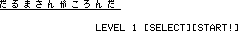

だるまさんがころんだ６
==

 

対応環境
--

- [SHARP製 PC-E500系 ポケットコンピュータ](https://ja.wikipedia.org/wiki/%E3%83%9D%E3%82%B1%E3%83%83%E3%83%88%E3%82%B3%E3%83%B3%E3%83%94%E3%83%A5%E3%83%BC%E3%82%BF%E3%81%AE%E8%A3%BD%E5%93%81%E4%B8%80%E8%A6%A7#PC-E500%E7%B3%BB)

実行方法
--

コードを転送後、つぎの手順に従って操作してください。

1. `RUN*AREA`としてマシン語エリアを確保してください。
2. `RUN*SET`と操作してグラフィックデータを作成してください（約9分かかります）
3. 以上の作業が完了しましたら`RUN`してください
4. プログラム実行中に中断した場合にフォントを戻すには、`GOTO*END`してください

遊び方の説明
--

「だるまさんがころんだ」をモチーフとしたゲームです。 
タイトル画面で`[START!]`を押すとゲームを開始します。`[SELECT]`を押すとスタート時のレベルを今まで到達できた最高レベルまでから選ぶことができます。 
ゲーム画面の右にいる大きな人がプレイヤーキャラクタです。ゲームの目的はプレイヤーキャラクタを左端に到達させることです。 
画面左のボックスはタイマーゲージで、満タンになるとミスになってしまいます。ゲーム中はタイマーゲージの上部に「だるまさんがころんだ」が順番に表示されます。テンキーの`1`と`3`を交互にテンポよく押してプレイヤーキャラを進めてください。 
プレイヤーキャラクタは、両足を地面につけている状態以外ではバランスを崩してブルブル震えてしまいます。このとき「だるまさんがころんだ」と言い終えられてしまうとミスになります。そうならないよう気をつけて進めてあげてください。レベルは５まであり、高くなると読み上げのスピードが速くなっていきます。 
MISS!!と表示されたときは`[RETURN]`キーでリトライ、`[MENU]`キーでタイトルメニューに戻ります。 
ゲームを終了させるときはタイトルメニューで`[E]`キーを押してください。

参考にしたもの
--

- [御茶目菜子さん](http://ochameclub.web.fc2.com)制作
  - [オールBASIC超高速画面描画ルーチンOPAS](http://ochameclub.web.fc2.com/E500/TECH/OPAS.HTM)
  - [PSS（ポケコン用ソフト統一規格）ver.1.1](http://ochameclub.web.fc2.com/E500/TECH/PSS.HTM)
