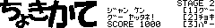

後出しじゃんけん
==

対応環境
--

- [SHARP製 PC-E500系 ポケットコンピュータ](https://ja.wikipedia.org/wiki/%E3%83%9D%E3%82%B1%E3%83%83%E3%83%88%E3%82%B3%E3%83%B3%E3%83%94%E3%83%A5%E3%83%BC%E3%82%BF%E3%81%AE%E8%A3%BD%E5%93%81%E4%B8%80%E8%A6%A7#PC-E500%E7%B3%BB)

実行方法
--

コードを転送後、つぎの手順に従って操作してください

1. `RUN*AREA`としてマシン語エリアを確保してください。
2. `RUN*SET`と操作してグラフィックデータを作成してください
3. 以上の作業が完了しましたら`RUN`してください
4. プログラム実行中に中断した場合にフォントを戻すには、`GOTO*END`してください

つぎの手順はオプションです

- [Plink](http://www.kt.rim.or.jp/~tmizuno/pocket/library/sharp05.html)等でバイナリ転送が可能な場合、`LOADM"JYAN.PGD"`を実行することでリッチなグラフィックデータを使用できます
- コードをチェックするには`RUN*ALICE`してください

遊び方＆説明
--

じゃんけんのゲームですが、普通に勝負をするのではなくコンピュータが出した手に対して指示通りにこちらが手を出すゲームです。タイトル画面ではPF2キーでゲーム開始、Ｅキーを押すとフォントを元に戻して終了できます。 
ゲームを始めると「ジャンケン」の合図の後、画面左側でスロットのように絵柄がめまぐるしく変化する状態になります。左側がコンピュータの出す手、その右隣が「勝て」「負けて」「あいこ」などの指示になります。しばらく立つと絵柄は自然に止まりますから、両方止まったら瞬時に出すべき手を判断してテンキーの１～３でそれぞれ「グー」「チョキ」「パー」を出しましょう。出した手が指示通りならば、押すまでの時間に応じてスコアが加算されます。４ステージ終了した時点での合計スコアを競いましょう。 
スロットのように変わっていく絵柄の止まる順番はステージと関係があります。ハイスコア目指して頑張ってくださいね！

参考にしたもの
--

- [御茶目菜子さん](http://ochameclub.web.fc2.com)制作
  - [オールBASIC超高速画面描画ルーチンOPAS](http://ochameclub.web.fc2.com/E500/TECH/OPAS.HTM)
  - [PSS（ポケコン用ソフト統一規格）ver.1.1](http://ochameclub.web.fc2.com/E500/TECH/PSS.HTM)
  - [オートリストチェッカー「アリスちゃん」ver.1.0](http://ochameclub.web.fc2.com/E500/TECH/ALICE.HTM)