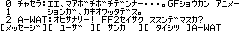
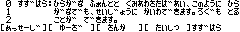

オフラインチャット
==

 

対応環境
--

- [SHARP製 PC-E500系 ポケットコンピュータ](https://ja.wikipedia.org/wiki/%E3%83%9D%E3%82%B1%E3%83%83%E3%83%88%E3%82%B3%E3%83%B3%E3%83%94%E3%83%A5%E3%83%BC%E3%82%BF%E3%81%AE%E8%A3%BD%E5%93%81%E4%B8%80%E8%A6%A7#PC-E500%E7%B3%BB)

実行方法
--

1. コードを転送後、`RUN`してください

使い方の説明
--

参加者間でポケコン本体を物理的に手渡しながら会話するチャットです。ネットワーク機能はありません。

プログラムを開始すると、ROOTという名前のユーザー名でチャットに入室した状態になります。 
ログファイルを出力するには、`L`を押してから出力ファイル名をドライブ名を含むフルパスで入力してください。ログファイルを閉じるには、もう一度`L`キーを押してください。

発言するには`[PF1]`キーを押してください。このとき画面上部3行に上から記録されていきます。ログファイルを開いている場合、ログにも出力されます。画面上のログは20発言分保持されます。画面をスクロールするには、カーソルの上下キーを押してください。

新しいユーザでチャットに参加するには、`[PF3]`キーを押してください。8文字以内で名前を入力してください。 
退室するには`[PF4]`キーを、ユーザを変更するには`[PF2]`キーを押してください。
