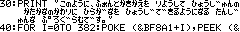

ひらがなフォント
==

対応環境
--

- [SHARP製 PC-E500系 ポケットコンピュータ](https://ja.wikipedia.org/wiki/%E3%83%9D%E3%82%B1%E3%83%83%E3%83%88%E3%82%B3%E3%83%B3%E3%83%94%E3%83%A5%E3%83%BC%E3%82%BF%E3%81%AE%E8%A3%BD%E5%93%81%E4%B8%80%E8%A6%A7#PC-E500%E7%B3%BB)

実行方法
--

コードを転送後、つぎの手順に従って操作してください

1. `POKE &BFE03,&1A,&FD,&B,0,1,&7E:CALL &FFFD8`と操作して、マシン語エリアを確保します
2. `RUN`してください
